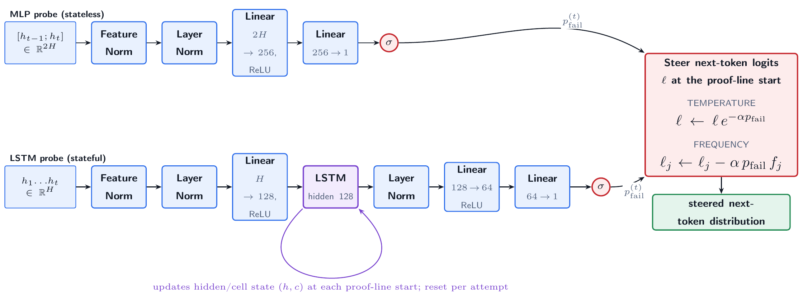

# Provers Know When They Are Failing

Companion artifacts for *Provers Know When They Are Failing: Internal-State Probes for Kernel-Verified Theorem
Proving*.

We train a small probe (under 3M parameters) that reads a **frozen** Goedel-Prover-V2's internal state between
proof lines and predicts whether the current attempt will fail. Its labels are Lean kernel verdicts. We then feed
that failure probability back into generation to steer the same model. Every score here is checked by an
independent **robust verification protocol**: a fresh Lean process per proof, with an axiom-set check.

**Three contributions, in the order they build on each other.** *Measurement* comes first, because nothing after
it means anything otherwise: a proof counts only when a fresh Lean process accepts it and the axioms it rests on
stay inside the trusted set. *The signal* comes next: the failure signal the probe reads is real, it transfers to an unseen
problem domain, and it is available **early**, before an attempt's length reveals anything. *The steering result*
comes last: feeding that signal back into generation does not improve the prover, and we say why.

This repo is deliberately small: the **robust verifier**, the **probe checkpoints**, two short **usage guides**,
and the **per-attempt robust results** (every sampled attempt, passing and failing, with its verdict and Lean
source) for every arm on MathOlympiadBench. It does **not** contain the training or generation pipeline.

## Verification contract

A proof counts as solved only if, in a fresh Lean process under mathlib4 (Lean 4.9.0-rc1), it compiles with no
`error:`, no `declaration uses 'sorry'`, and an axiom set contained in `{propext, Classical.choice, Quot.sound}`
(checked with `#print axioms`). A long-running Lean server, by contrast, accepts proofs of `False` that this
protocol rejects; `guides/robust_verification_example.md` contains one. See
[`robust_verification/`](robust_verification/).

## The probes

Two heads were trained, an MLP and an LSTM. **The deployed controller is the LSTM.** At each **line start**
(the indentation that opens a proof line) it reads the base model's final-normalization hidden state and outputs a single failure probability
`p_fail`, which steers the next-token logits. The selected setting is the same on both base models:
**frequency penalty, `alpha = 0.15`** (`logits[j] <- logits[j] - alpha * p_fail * freq[j]`). Checkpoints are in
[`probes/`](probes/); the line-start token set is in
[`probes/boundary_token_ids.json`](probes/boundary_token_ids.json)
(the filename keeps the earlier internal name).

## Results (robust pass@32, single-run)

| | MathOlympiadBench 8B | MathOlympiadBench 32B |
|---|---:|---:|
| Base    | **41** | **60** |
| Steered | 35 | 59 |

Denominator: 360 theorems. **Out of domain, steering does not help**: it solves 6 fewer theorems than the base on
8B and 1 fewer on 32B. Neither difference is statistically significant at k=32, the budget the comparison was designed around
(paired exact McNemar, p = 0.109 and p = 1.00), so we report a negative result rather than a measured degradation.

The steadier effect is one level down: verifying attempts fall from 560 to 461 on 8B and from 897 to 744 on 32B,
about a sixth on each. The two policies are not nested, though: steering proves 2 theorems on 8B and 5 on 32B
that the base never proves, while losing 8 and 6. One theorem, `Usa2001P3`, is a regression on 8B and the largest
gain on 32B.

## Layout

- [`robust_verification/`](robust_verification/) - the verifier (`verify_lean_robust.py`) and how to run it.
- [`labeling/`](labeling/) - how an attempt becomes a label: the two theorem filters, the verify-time
  blinding, the attempt-level filters, the deployed code, and tests that demonstrate each one.
- [`probes/`](probes/) - the probe checkpoints, the line-start token set, and their configuration.
- [`guides/`](guides/) - `robust_verification_example.md`, `labeling_example.md` and
  `steered_generation_example.md`, each on an example theorem.
- [`tests/`](tests/) - checks that the shipped results and probes match what this README claims.
- [`results/`](results/) - three files per arm on MathOlympiadBench:
  - `*_attempts.jsonl.gz` - **every** sampled attempt (all 32 per theorem, passing and failing), each row with
    `theorem_id`, `attempt`, `valid`, `exit_code`, `axioms`, and `full_code` (the exact Lean source verified).
  - `*_robust_verdicts.jsonl` - the same per-attempt verdicts without the proof text, uncompressed for quick
    scanning.
  - `*_solved_proofs.jsonl` - the full Lean source of every verifying attempt.

  A theorem counts as solved when at least one of its attempts is `valid`; these per-theorem counts reproduce the
  table above. Only the assembled Lean source is stored, not the model's raw chain-of-thought or token-level
  telemetry.

  **Joining a base arm to a steered arm: strip the `imo_sl_` prefix first.** The two arms were produced by
  different runs and kept the theorem-id spelling each run used, so 131 of the 360 theorems appear as
  `2006_A1` in a `*_base_*` file and as `imo_sl_2006_A1` in the matching `*_steer_*` file. Per-arm counts are
  unaffected, but a naive join by `theorem_id` silently drops those 131 on both sides and gives the wrong
  per-theorem gains and losses. Under the canonical id, `theorem_id.removeprefix("imo_sl_")`, the two arms
  share all 360 theorems and reproduce the gains and losses quoted above (2 and 8 on 8B, 5 and 6 on 32B);
  `tests/test_results_artifacts.py` pins exactly that.

## Labelling contract

Verification decides whether a *proof* is real. Labelling decides whether a *training example* is honest, and
it needs its own contract, because every training and validation theorem is a mathlib lemma: the environment
that checks a candidate proof already contains the answer. Under a full `import Mathlib` the rebuilt
declaration collides with the original and Lean rejects it before reading the proof, which force-failed
**1,018 of the 1,367** training theorems.

Seven mechanisms answer that, in order. A **dead-statement filter** drops theorems whose statement already
fails to compile (1,367/419 -> 1,080/319). A **`__us` rename** then makes the rebuilt declaration legal, and a
**statement-elaboration filter** keeps only theorems whose rebuilt `header + statement := by sorry` compiles
*with that rename applied* (-> **243 / 90**); without the rename a collider is rejected as *already declared*
before Lean reaches the statement. The rename and two further header lines blind the checker at verification
time only, never in the prompt: **`attribute [-simp]`** on every collider, and **`attribute [-aesop]`** in
addition on the two colliders that are registered aesop rules. Two act per
attempt: a **crutch purge** (drop an attempt that fails with the guard but passes without it) and a
**citation filter** (drop any success whose proof names the target). Alongside those seven, an **attribute-error guard** excludes an
attempt whose prepended attribute line itself errored.

**A positive means three things at once**: it compiled under the guard, it did not cite the target, and it did
not lean on the target's own automation entry.

The crutch purge is **training-only, by design**: it removes only attempts that already failed under the
guard, and the validation contest counts solves, so it cannot change a solved or passing count there.
`l2_residual_timeout` is **not** a filter: it is surfaced for reporting, and such an attempt stays an
ordinary failure, which is why every score is a lower bound.

| filter | training 8B / 32B | validation 8B / 32B (13 arms) |
|---|---|---|
| attribute-error guard | 0 / 0 | 0 / 1 |
| citation filter | 71 / 51 | 106 / 100 |
| crutch purge | 23 / 2 | not applied |

See [`labeling/`](labeling/) for the deployed code and its tests, and `guides/labeling_example.md` for one
theorem end to end.

## Caveats worth reading before reusing these artifacts

- **Single run.** Every number here comes from one run, and we report no confidence intervals on any ROC-AUC.
- **The training labels are leakage-reduced, not leakage-free.** The probes are trained on mathlib-derived
  theorems, so the environment that checks a proof already contains the target lemma. Our labeling is *target-blinded*: it removes the
  target's own citation and its `simp`/`aesop` entries, but Lean cannot hide a differently-named sibling from an
  imported environment, and some solved theorems are not what they are named, because the extraction span can
  truncate a statement or pick up a neighbouring declaration. This is why the headline evaluation is
  out of domain, on olympiad theorems, where the clash cannot arise. Checking the proof in its own file
  instead would remove the target by construction; [`labeling/`](labeling/) explains why we did not, and why
  neither choice is leakage-free.
- **One theorem is force-failed by our own header.** The header emits the target's *complete* name. The
  validation theorem `gcd_greatest` is declared at root level, so that name carries no prefix, and the
  header's `open Nat` then makes it collide with `Nat.gcd_greatest`; Lean errors on the attribute line before
  reading the proof, so all 104 of its attempts fail regardless of the model. It is in neither the training
  nor the test set and scored zero in every contest arm, so it moved no result. It is also the **only** broken
  header in the project, which we measured rather than argued: over the 243 training theorems the stored
  compiles show no error on any theorem's attribute line, and in validation a broken header would fail every
  attempt of its theorem, so we compiled the header of each of the 28 theorems that scored zero in every arm
  and found this one. A namespace-less complete name is the reason it happens, not the evidence that it
  happens only here.
- **The attribute-error guard has two blind spots, and has never bound.** It matches `not registered`,
  `unknown identifier` and `unknown constant`, but not `ambiguous identifier`, which is exactly why the case
  above was never surfaced. It also matches the target's name as a quoted identifier, and Lean quotes names as
  `'X'`, so a sibling ending in a prime makes the target's own quoted form a substring of an unrelated error.
  The guard fired exactly once in the project, on `Ordinal.lift_lt` in one 32B contest arm, and that firing
  was a **false positive** of exactly that kind: the error came from the proof body, which used the primed
  sibling `Ordinal.lift_lt'`, while the attribute line compiled cleanly. That attempt was failing anyway, so
  the guard changed no label and no count anywhere in this project. Both weaknesses are left as they ran: the
  labels are frozen, and adding `ambiguous identifier` to the message list or anchoring the quoted match at a
  word boundary would change what was measured.
- **The citation filter matches positions, not mentions.** It flags the target's name after
  `exact`/`apply`/`refine`, immediately after `:=`, after `using`, before a rewrite arrow, or inside a
  `[...]` bracket. A name that appears somewhere else is not flagged, and two forms escape it: `aesop (add
  norm simp X)`, the aesop analogue of `simp [X]`, whose argument sits in parentheses rather than brackets and
  which occurs zero times in our generations; and Lean's explicit-argument prefix `@`, which defeats the `:=`
  and `using` patterns, so `have h := @X ...` is not flagged. Three real citations of that shape occur, all in
  *failing* attempts. That matters less than it sounds, and the formal
  definitions say why: the filter is consulted only on successes (the positive rule is `h ∧ ¬c`), and the
  negative rule is `¬s ∧ ¬e` with no `c` term, so a negative is by definition an attempt that failed *with the
  target fully available*, by name and through its automation. Citing is permitted there by construction, and
  permitting it is what makes the negative rule strict. Those three are the model applying the very lemma it
  was asked to prove and the kernel still rejecting the proof. The gap would matter for an *accepted* attempt
  of that shape, and none occurs. Neither gap is fixed: the labels are frozen.
  We swept **all 13,248 training and validation attempts** for the target's name appearing anywhere the filter
  does not look: 33 attempts mention the full name, all in *failing* attempts, and 29 of those 33 are the model
  echoing the theorem statement in a comment rather than citing it; 71 accepted attempts mention only a short
  name, and none of those refers to the target (`id` the identity function, the `ext` tactic, a `.map` field,
  and one `simpa [toReal] using Real.toReal_zero` where the target was `EReal.toReal_zero` — that identifier
  does not exist and does no work, because `simp [toReal]` closes the goal on its own and the statement is
  true by definition). **No accepted proof cites the target through an uncaught form.**
- **The citation filter has two measured limitations.** It reads the raw proof text, so a target named inside
  a comment counts; across all 13,248 attempts the full name sits only inside a comment in 29, all of them
  negatives, so no positive was affected. And it matches the target's *short* name, so a different lemma
  sharing that name and reachable through `open` or the namespace, a **short-name homonym**, can trigger a
  drop: 7 of the 122 drops are homonyms. Five of those seven cite the target's own *more general form* or an
  *alias* of it, which are leakage channels we list anyway, so the drop is right for the wrong reason; two
  cite a genuinely different lemma. Restoring all seven would move the positive-theorem counts from 88/92/103
  to 89/94/105 and touches no benchmark number. See [`labeling/`](labeling/).
- **Seven of the 360 benchmark prompts are damaged by the released prompt builder.**
  Goedel-Prover-V2 forms each prompt as `lean4_code.split(":= by")[0] + ":= by sorry"`, cutting at the
  *first* `:= by`. On five theorems an auxiliary `instance`/`def` carries a literal `:= by` before the
  theorem, so the prompt stops there and the statement to be proved never appears: `Imo1987P1`,
  `Usa2023P4`, `Usa2023P5`, `imo_sl_2008_C4`, `imo_sl_2022_A6`. On two more the theorem is written with a
  line break between `:=` and `by`, so no literal `:= by` is found and a second `:= by sorry` is appended to
  one already there: `imo_sl_2010_A3`, `imo_sl_2020_A3`. We keep the released prompt byte for byte, and the base and
  the steered runs were both decoded from it, so no comparison is affected; six of the seven are never solved
  by any run, which is why they look unsolvable in `results/`. The prompts are not stored here, but the behaviour is
  reproducible from the released builder plus `dataset/MOBench.jsonl`.
- **The probes are not calibrated out of domain.** They discriminate well, but `p_fail` sits near 1 almost
  everywhere on MathOlympiadBench, including on attempts that go on to verify.
